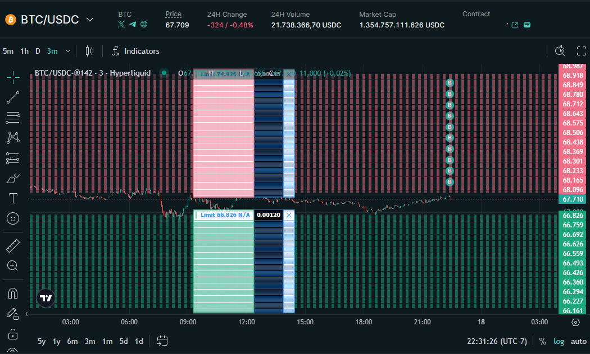
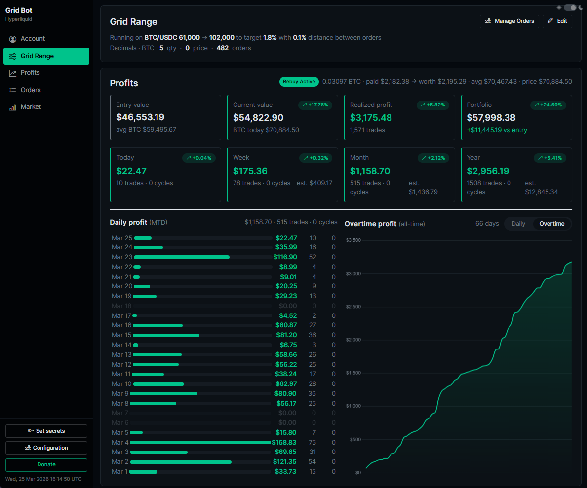

# Grid Trading Bot

Hyperliquid view:

Dashboard view:

Please read this README first. If you run into any issues, join the Telegram group for setup help:
https://t.me/hyperliquidbotgrid

## Overview

This Grid Trading Bot is designed to generate passive income from market volatility while operating strictly within a defined price range.

Instead of predicting direction, the bot:

- Works inside a configurable price range
- Buys low and sells high repeatedly
- Accumulates more BTC (or base asset) over time
- Generates realized profit per completed cycle
- Avoids leverage (no liquidation risk)
- Can operate continuously in ranging markets

The idea is simple but powerful: **volatility becomes income**.

------------------------------------------------------------------------

## Real Backtest Performance (BTC Grid Example)

To demonstrate the effectiveness of this strategy, here is a real backtest using BTC:

**Period:** 2025-12-01 → 2026-02-26 (86.71 days)
**Grid Levels:** 614
**Base USD per level:** $100.00
**Total allocated notional (BTC + USD):** $61,400.00

### Results

- Total Cycles Completed: 2,419
- Total Profit: $4,131.77
- Return on Total Capital: 6.73%
- Average Profit per Cycle: $1.7080

### Fee rate per side: 0.0384%

- Performance Breakdown
- Per day: $47.65 (0.08%)
- Per week: $333.55 (0.54%)
- Per month: $1,429.48 (2.33%)
- Per year: $17,392.04 (28.33%)

### Why This Is Powerful

28.33% projected yearly return without leverage (based on this period)

- No liquidation risk
- Capital always inside a controlled price range
- Profit generated purely from volatility
- Scales linearly with capital
- Does not require allocating 100% of your USD to active buy orders — unused capital can stay in yield strategies (like lending or liquidity pools), generating ~5% APY in parallel

The bot does not need trend prediction.
It simply monetizes market movement.

------------------------------------------------------------------------

## Why This Strategy Is Strong

1. No Stop-Loss Required - The bot operates inside a predefined range. It does not rely on stop-loss mechanisms to function.

2. No Liquidation Risk - The strategy is spot-based (or non-liquidated environment). There is no leverage exposure.

3. Profits From Volatility - Sideways markets are ideal. Every oscillation between grid levels produces income.

4. BTC Accumulation - When configured with rebuy logic, realized profits can be reinvested automatically, increasing long-term BTC exposure.

5. Passive Structure - After setup, the bot runs automatically: - Places limit orders - Detects fills - Reverses side - Tracks profits - Manages capital allocation

------------------------------------------------------------------------

## How The Bot Works (Concept Explained)

The bot creates multiple micro price ranges inside a larger defined range.

Each micro range generates a fixed profit target.

Instead of predicting direction, the bot waits for price oscillation.

Every time price moves up and down inside the grid, it earns a fixed percentage.

--------------------------------------------------

Step-by-Step Logic

1) You define a price range:

- entry_price (bottom)
- exit_price (top)

2) The bot divides this range into multiple grid levels.

3) For each level:

- It places a BUY order at a lower price.
- It places a SELL order above it (target_percent higher).

4) When BUY is filled:
   → It immediately places the SELL above.

5) When SELL is filled:
   → Profit is realized. → A new BUY is placed below. → The cycle continues.

(It may also operate as SELL → BUY if you start while already holding the asset and the price is in the middle of the range.)

The important point is that profit is only realized and accounted for when a full cycle is completed:

BUY → SELL  
or  
SELL → BUY

A partial movement does not count as profit. Only when the cycle closes is the gain officially recorded.

--------------------------------------------------

Example (Simple BTC Scenario)

Imagine:

- BTC price = 60,000
- target_percent = 1.8%
- usd_transaction = 100 USDC

Bot places:

BUY at 60,000 SELL at 61,080  (1.8% profit)

If price moves:

60,000 → 61,080

The SELL fills.

Profit ≈ 1.8 USDC (minus fees).

Then the bot places:

New BUY at 60,000 (or next grid level)

If price oscillates:

60,000 ↔ 61,080 ↔ 60,000 ↔ 61,080

The bot earns 1.8% repeatedly.

--------------------------------------------------

Why This Works

Markets often move sideways.

Instead of waiting for a huge breakout, the bot monetizes small movements.

Volatility becomes income.

--------------------------------------------------

What Happens in a Downtrend?

If price drops:

The bot keeps buying lower grid levels.

No liquidation risk (spot-based). You accumulate BTC.

When price eventually rebounds, the SELL levels above start filling again.

--------------------------------------------------

What Happens in a Strong Uptrend?

If price moves above your exit_price:

The bot stops creating new grid levels. You hold accumulated BTC.

You can then:

- Adjust the range upward.
- Or restart the grid higher.

--------------------------------------------------

Core Idea

This bot does NOT try to predict direction.

It harvests volatility.

Every oscillation inside your range generates income.

The more healthy sideways movement, the more consistent the returns.

------------------------------------------------------------------------

## Capital Protection

### Order Block System

The bot can place a reserve BUY limit to "block" free USDC and prevent over-allocation.

### Cleanup Logic

Old grid levels far from price are periodically cleaned to:

- Reduce open orders
- Improve efficiency
- Prevent unnecessary capital exposure

------------------------------------------------------------------------

## Rebuy Logic

When enabled:

- Profit accumulates in a rebuy wallet
- Once threshold is reached
- A MARKET BUY is executed
- BTC accumulation increases
- Stats are persisted

This compounds volatility into long-term asset growth.

------------------------------------------------------------------------

## Environment Variables

Check .env.example

------------------------------------------------------------------------

## Quick Start

- See `README_DOCKER.md`

------------------------------------------------------------------------

## Hyperliquid Setup (API Wallet + Keys)

This bot uses Hyperliquid "API Wallet" credentials (agent wallet).

Important:

- `wallet_address` must be your MAIN / linked account address on Hyperliquid (the one that actually holds funds).
- `private_key` must be the API Wallet PRIVATE KEY generated on Hyperliquid (agent wallet private key).
- Do NOT use the API wallet address as `wallet_address`.

### Generate Hyperliquid API Wallet Private Key

1) Log in to Hyperliquid.
   https://app.hyperliquid.xyz/join/BOTGRID

2) Use BOTGRID referral to earn 4% discounts in fees.

3) Open the API page:
   https://app.hyperliquid.xyz/API

4) Create a new API Wallet:
    - Enter a name
    - Click Generate
    - Click "Authorize API Wallet" (do not skip authorization)

5) Copy the Private Key shown (this is what you store as `private_key` in the bot).

6) Copy your MAIN account address (top-right account dropdown / wallet shown in UI). That is what you store as `wallet_address` in the bot.

Notes:

- Some setups require you to deposit funds before you can authorize an API wallet.
- Treat the API wallet private key like a password.
- NEVER SHARE IT WITH ANYONE.
- If someone gets access to your API wallet private key:
  • They cannot withdraw your funds. • BUT they can place trades. • They can intentionally execute bad trades and destroy your balance.

If you believe your private key has been exposed:

1) Go to the Hyperliquid API page.
2) Revoke the compromised API wallet.
3) Generate a new API wallet.
4) Update your database immediately.

---

## Deposit Funds (Recommended: USDC on Arbitrum One)

Hyperliquid deposits are designed for **USDC on Arbitrum One**. This is usually the cheapest + simplest path.

### Important notes

- **Only USDC on Arbitrum One is supported for deposits.** If you send other tokens (ETH/ARB/USDT/etc) your funds may not be credited.
- You’ll also want a tiny amount of **ETH on Arbitrum** to pay gas for the USDC approval/deposit transaction.

### Option A) Deposit from a centralized exchange (easiest)

1) On Hyperliquid, open the **Trade** page and click **Deposit**.
2) Copy your **USDC deposit address**.
3) In your exchange, withdraw **USDC**:
    - Network / chain: **Arbitrum One**
    - Address: paste the Hyperliquid deposit address
4) Wait for confirmations, then refresh Hyperliquid.

### Option B) Bridge USDC to Arbitrum first (if your USDC is on another chain)

1) Bridge/move your funds so you end up with **USDC on Arbitrum One** (and a little ETH on Arbitrum for gas).
2) On Hyperliquid, click **Deposit** and deposit the Arbitrum USDC.

### Avoid: sending BTC on the Bitcoin network “just to fund the account”

Bitcoin network fees can be high, and it’s easy to do the “wrong chain / wrong asset” mistake.
For most users, **USDC on Arbitrum One** is the recommended funding method.

------------------------------------------------------------------------

### Deployment Recommendation (Security)

We strongly recommend running this bot locally (your own PC / private server you fully control).

Reason:
- This bot uses sensitive credentials (exchange private key + Telegram token).
- The safest setup is keeping everything on a machine you control.

------------------------------------------------------------------------

## Profit target

We strongly recommend starting with:

- target_percent = 1.8

Why:

- It gives a decent profit per cycle while avoiding too many trades.
- It reduces fee impact compared to very small targets (fees become a big part of the profit).
- It behaves well in real volatility and avoids over-trading.

Notes:

- margin_percent controls the spacing between grid levels (how dense the grid is).
- target_percent controls the profit target for each completed BUY->SELL (or SELL->BUY) cycle.
- A common approach is margin_percent <= target_percent (so orders are not too dense compared to the profit target).

------------------------------------------------------------------------

## Health Monitoring (Healthchecks.io)

This bot supports optional uptime monitoring using Healthchecks.io.
It will periodically ping a Healthchecks endpoint.
If the bot stops running and no ping is received within the configured grace time, Healthchecks will trigger an alert.

Setup

Create a new check at https://healthchecks.io

Copy your Ping URL (example):

    https://hc-ping.com/your-uuid-here

Add the following to your .env:

    HEALTHCHECKS_PING_URL=https://hc-ping.com/your-uuid-here
    HEALTHCHECKS_PING_INTERVAL_MS=60000

HEALTHCHECKS_PING_INTERVAL_MS should match your check period (example: 60000 = 1 minute).

How It Works

When the bot starts, it begins pinging the configured URL.

If the process crashes or stops, the pings stop.

After the configured grace time, Healthchecks sends an alert.
This feature is optional. If HEALTHCHECKS_PING_URL is not set, no monitoring is performed.

------------------------------------------------------------------------

## Final Notes

This bot:

- Does not predict direction
- Monetizes volatility
- Avoids leverage risk
- Accumulates BTC over time
- Produces steady grid-based income in ranging markets

It performs best in sideways or oscillating conditions.

Long-term trending markets require appropriate range adjustments.

------------------------------------------------------------------------

Built for disciplined volatility harvesting.